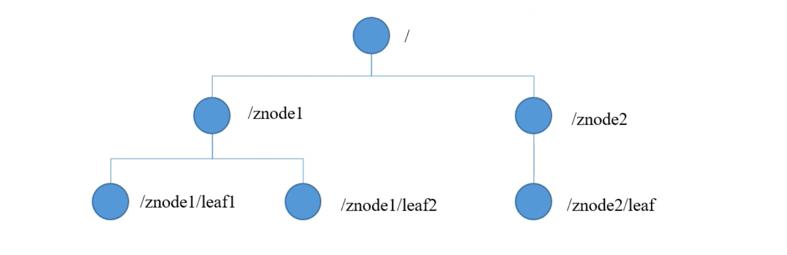

### Zookeeper介绍

***

> **zookeeper是一个分布式的，为分布式应用提供协调服务的项目**
>
> 在hadoop中，hadoopHA、kafka和Hbase需要用到zookeeper

#### Zookeeper的作用

> Zookeeper只干两件事，一是存数据，二是通知
>
> 一个分布式应用在Zookeeper上注册之后，Zookeeper就会储存这个应用的一些信息。当这个这些信息发生了变化，Zookeeper就会把这个变化通知给其他已经注册了的应用（监听者模式）

#### Zookeeper集群

> Zookeeper一般以集群的方式存在，把其中一个定义为leader，其他的为follower
>
> 集群中只要有一半以上的节点存活，Zookeeper集群就能正常提供服务
>
> 集群中所有节点保存的数据都是完全一样的
>
> 当一个分布式应用要更新他在Zookeeper上保存的信息时，它会发送了一条或多条更新请求，无论Zookeeper收到这些更新请求的顺序是什么，Zookeeper执行这些请求的顺序必须和应用发送他们的顺序一致
>
> 数据更新具有原子性，如果一个应用发送了数据更新的请求，要么所有Zookeeper节点都更新成功，要么所有节点都不更新

#### Zookeeper的数据结构

> Zookeeper的数据结构是一个树，每个节点能存1MB数据。每个节点都有一个路径作为他的唯一标识

##### 节点类型

> 持久节点：客户端和服务器端断开连接后，创建的节点不删除
>
> 短暂节点：客户端和和服务器端断开连接后，创建的节点自己删除