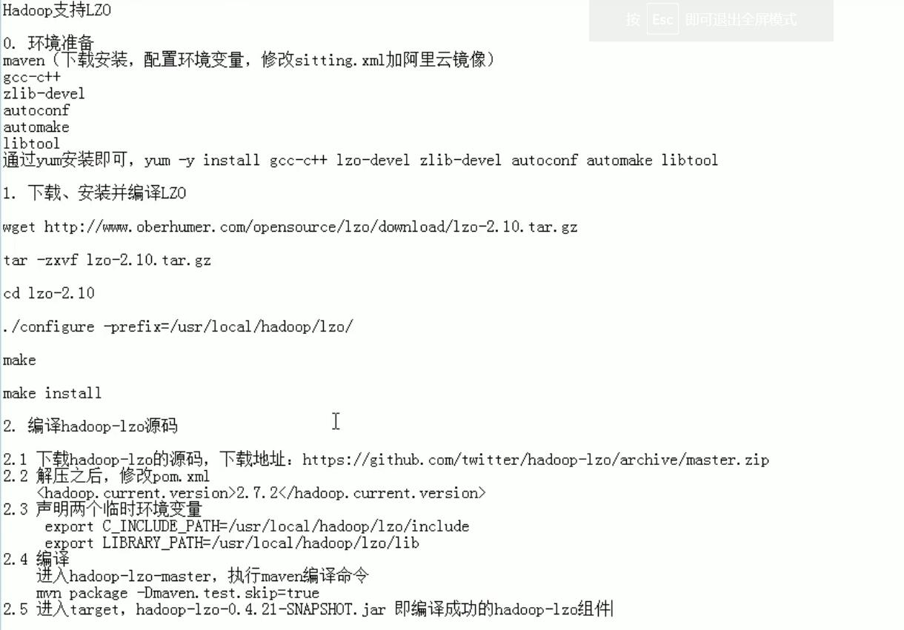

### LZO压缩的配置和使用——hadoop中常用的压缩方式

***

#### 介绍

>LZO是hadoop中常用的一种压缩方式，优点是速度快，可切片
>
>hadoop本身不支持LZO压缩，我们需要使用twitter提供的hadoop-lzo组件
>
>我们这里用的LZO分为两块，一是lzo-2.10.tar.gz，他只是个压缩和解压缩的工具。我们想让hadoop也用上这个，那就得用上twitter提供的hadoop-lzo，让hadoop-lzo在hadoop和lzo的环境下编译，然后生成的lzo jar包才能正常的在hadoop上工作


#### LZO的获取

> 因为不同版本的hadoop有不同之处。所以我们需要根据我们的环境将LZO编译好，这样LZO就能完美的适配我们的hadoop


#### LZO的编译

> 


#### LZO的配置

> 因为提供了合适的编译后的hadoop-lzo-0.4.20,jar，所以这里直接进行配置
>
> 首先将编译好的jar包放入hadoop/share/hadoop/common/下，share文件夹中放的是一些官方案例
>
> 然后用同步命令将其同步到其他主机中	xsync hadoop-lzo-0.4.20.jar

***

##### core-site.xml，增加以下属性，使其支持LZO压缩

```xml
<!-- 指定hadoop中支持的压缩器，没有这个属性的话，会默认支持几个压缩器 -->
<property>
    <name>io.compression.codecs</name>
    <value>
        org.apache.hadoop.io.compress.GzipCodec,
        org.apache.hadoop.io.compress.DefaultCodec,
		org.apache.hadoop.io.compress.BZip2Codec,
		org.apache.hadoop.io.compress.SnappyCodec,
        com.hadoop.compression.lzo.LzoCodec,
        com.hadoop.compression.lzo.LzopCodec
    </value>
</property>

<!-- 指定LZO压缩用的压缩器就是LzoCodec -->
<property>
    <name>io.compression.codec.lzo.class</name>
    <value>com.hadoop.compression.lzo.LzoCodec</value>
</property>
```

***

##### 同步修改后的core-site.xml，并重启hadoop集群

``` bash
xsync core-site.xml    #要去到文件的所在目录，在执行同步命令
$HADOOP_HOME/sbin/start-dfs.sh	因为修改了core-site.xml,所以要重启集群
$HADOOP_HOME/sbin/start-yarn.sh
```


#### LZO的测试

##### 以LZO文件为输入源，进行WordCount计算

```bash
#把LZO压缩格式的文件放进hdfs，这时这个文件是单切片的
hadoop fs -put bigtable.lzo /input/

#执行官方案例。hadoop-mapreduce-examples-2.7.2.jar是官方提供的一些mapreduce的案例，现在我们调用其中的wordcount类。/input和/output1作为args参数传入main方法中。/input作为输入源，/output1作为输出。
#因为这个LZO文件是单切片的，所以云计算时不能把他拆开放在多台主机上计算。
hadoop jar /opt/module/hadoop/share/hadoop/mapreduce/hadoop-mapreduce-examples-2.7.2.jar wordcount /input /output1
```

***

##### 对LZO文件建立索引

``` bash
#对LZO压缩文件建立索引，这样的话就会在原来的LZO文件旁边多一个索引表文件。这时这个LZO文件就是多切片的，在进行分布式计算时，就能把这个文件分成几块，放在不同主机上进行分布式计算
hadoop jar $HADOOP_HOME/share/hadoop/common/hadoop-lzo-0.4.20.jar com.hadoop.compression.lzo.DistributedLzoIndexer /input/bigtable.lzo

```

